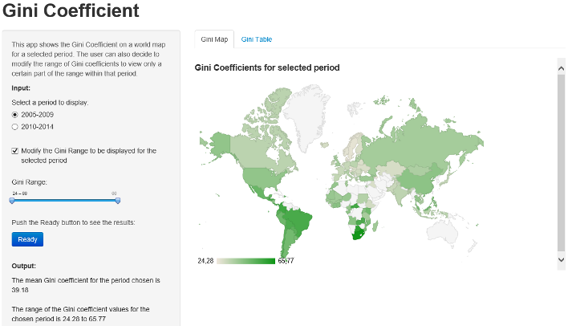

Gini coefficients around the world
========================================================

#### Interactively analyzing the Gini coefficients over different periods around the world

A shiny app developed for the Developing Data Products course as part of the [Data Science specialization](https://www.coursera.org/specialization/jhudatascience/1?utm_medium=listingPage) by John Hopkins University on Coursera. 

author: Daan Hoevers
date: 23 January 2014

<small> RStudio Presenter code of this pitch on [Github](https://github.com/DaanHoevers/Developing_Data_Products_Pitch) </small>

Gini coefficient explained
========================================================
id: slide2

<small> The Gini coefficient measures the extent to which the distribution of income or consumption expenditure among individuals or households within an economy deviates from a perfectly equal distribution. 
* A Lorenz curve plots the cumulative percentages of total income received against the cumulative number of recipients, starting with the poorest individual or household. 
* The Gini index measures the area between the Lorenz curve and a hypothetical line of absolute equality, expressed as a percentage of the maximum area under the line. 
* Thus a Gini index of 0 represents perfect equality, while an index of 100 implies perfect inequality. 
* For more information on the Gini coefficient please review the Wiki page on the [Gini Coefficient](http://en.wikipedia.org/wiki/Gini_coefficient)
* The Gini coefficients data is obtained from the [World Bank](http://data.worldbank.org/indicator/SI.POV.GINI") on 12 January 2015.</small>


Lowest and Highest Gini coefficients
========================================================
id: slide3


```
    Country.Name    Period Period.mean
341     Slovenia 2005-2009       24.28
402      Ukraine 2010-2014       24.82
25    Azerbaijan 2005-2009       24.84
342     Slovenia 2010-2014       24.91
105      Denmark 2005-2009       25.98
369       Sweden 2005-2009       26.08
```

```
    Country.Name    Period Period.mean
426       Zambia 2010-2014       57.49
51      Botswana 2005-2009       60.46
270      Namibia 2010-2014       61.32
348 South Africa 2010-2014       65.02
347 South Africa 2005-2009       65.27
331   Seychelles 2005-2009       65.77
```
<small>For R block code used to obtain these tables, see [Github](https://github.com/DaanHoevers/Developing_Data_Products_Pitch)</small>

Gini coefficient app
========================================================
<small> The app developed displays the Gini Coefficient on a world map which provides the user of a very convenient and well-organized overview. To zoom in on certain Gini ranges the app gives the user the ability to view only a certain part of the Gini coefficient range within that period. 



Find the Gini coefficient app on [Shiny Server](https://daanhoevers.shinyapps.io/Developing_Data_Products) and the code on [Github](https://github.com/DaanHoevers/Developing_Data_Products)</small>

Usability and Discussion
========================================================
<small>In the last slide, I would like to discuss the limitations of the Gini Coefficient App:
* The Gini Coefficient App can be extended a lot, it is only a first attempt to create a shiny app
* It has been chosen to aggregate the Gini coefficient available in years to 2 periods of 5 years
* Not for every country and each year the Gini coefficient is available, [see raw data](#/slide2)

And a limitation of Gini Coefficient as measure of inequality. [Source](http://en.wikipedia.org/wiki/Gini_coefficient#Limitations_of_Gini_coefficient)
* Gini coefficients are simple which can confuse the comparison of different populations; for example, while both Bangladesh (per capita income of $1,693) and the Netherlands (per capita income of $42,183) had an income Gini index of 0.31 in 2010. Review for again table on [slide 3](#/slide3)
